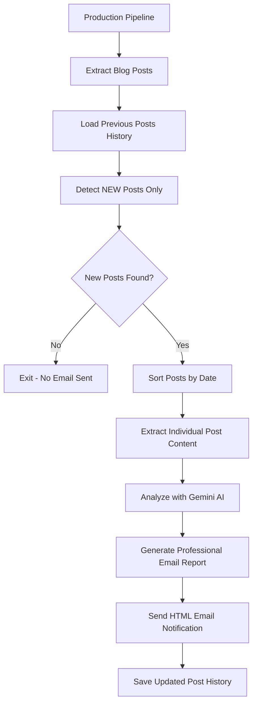

# Microsoft Edge Competitive Intelligence Bot 🔍

An advanced competitive intelligence system that monitors Chrome Enterprise blog posts, extracts new content, analyzes it with AI, and delivers professional email reports. Specifically designed for tracking Google Cloud Chrome Enterprise updates to inform Microsoft Edge strategy.

## 🌟 Features

- **Blog-Specific Monitoring**: Intelligently detects NEW blog posts (not just content changes)
- **Smart Content Extraction**: Fetches full article content from individual blog post URLs
- **AI-Powered Analysis**: Uses Google Gemini AI with custom prompts for competitive intelligence
- **Professional Email Reports**: HTML-formatted emails with tables, analysis, and direct links
- **Zero False Positives**: Only processes genuinely new posts, avoiding layout change noise
- **Automated Scheduling**: Runs every 6 hours via GitHub Actions (customizable)
- **Production Ready**: Comprehensive error handling, retry logic, and fallback mechanisms
- **Multiple Execution Modes**: Production monitoring, testing, and simulation modes

## 🚀 How It Works

1. **Blog Post Detection**: Extracts all blog posts from Chrome Enterprise blog listing
2. **New Post Identification**: Compares with previous posts to identify genuinely NEW publications
3. **Content Extraction**: Fetches complete article content from individual post URLs
4. **AI Analysis**: Analyzes each new post with custom competitive intelligence prompts
5. **Professional Reporting**: Generates structured HTML emails with analysis and metadata
6. **State Management**: Saves post history to prevent duplicate processing

## 📋 Prerequisites

- GitHub repository with GitHub Actions enabled
- Google Gemini API key ([Get one here](https://makersuite.google.com/app/apikey))
- Gmail account with app password ([Setup guide](https://support.google.com/accounts/answer/185833))
- UV package manager (for local development - installed automatically in GitHub Actions)

## 🔧 Setup Instructions

### 1. Configure GitHub Secrets

Add these secrets to your repository (`Settings > Secrets and variables > Actions`):

| Secret Name | Description | Example |
|-------------|-------------|---------|
| `GEMINI_API_KEY` | Your Google Gemini API key | `AIzaSyC...` |
| `EMAIL_USERNAME` | Gmail account to send from | `bot@gmail.com` |
| `EMAIL_PASSWORD` | Gmail app password (not regular password) | `abcd efgh ijkl mnop` |
| `EMAIL_TO` | Where to send notifications | `you@microsoft.com` |
| `SMTP_SERVER` | SMTP server (optional, defaults to Gmail) | `smtp.gmail.com` |
| `SMTP_PORT` | SMTP port (optional, defaults to 587) | `587` |
| `CUSTOM_AI_PROMPT` | Custom analysis prompt (optional) | Your custom prompt |

### 2. Customize Monitoring Schedule

Edit `.github/workflows/monitor.yml` to change the monitoring frequency:

```yaml
schedule:
  # Every 24 hours at 9 AM UTC (recommended for blog monitoring)
  - cron: '0 9 * * *'
  
  # Every 12 hours: '0 */12 * * *'
  # Every day at 6 AM: '0 6 * * *'
  # Every Monday at 9 AM: '0 9 * * 1'
```

### 3. Local Development Setup

```bash
# Clone the repository
git clone <your-repo-url>
cd web-monitor-bot

# Install UV package manager (if not already installed)
curl -LsSf https://astral.sh/uv/install.sh | sh

# Create virtual environment and install dependencies
uv venv
uv pip install -r requirements.txt

# Create .env file with your environment variables
cp .env.example .env
# Edit .env with your actual values

# Test the system
uv run python production_pipeline.py
```

## 🎯 Use Cases

- **Competitive Intelligence**: Monitor Google Cloud Chrome Enterprise announcements and updates
- **Feature Tracking**: Track new Chrome Enterprise features and capabilities  
- **Market Analysis**: Analyze Google's strategic direction and product roadmap
- **Technology Monitoring**: Stay informed about Google Cloud integrations and partnerships
- **Strategic Planning**: Inform Microsoft Edge enterprise strategy and positioning
- **Threat Assessment**: Early detection of competitive threats or opportunities

## 📁 File Structure

```
web-monitor-bot/
├── .github/workflows/
│   └── monitor.yml               # Updated GitHub Actions workflow ✅
├── monitor.py                    # Core monitoring functions and AI analysis
├── production_pipeline.py        # Main entry point for production monitoring
├── fast_full_test.py            # Quick testing script
├── quick_email_test.py          # Email testing utility
├── requirements.txt             # Python dependencies
├── pyproject.toml               # UV package manager configuration
├── TASK_LIST.md                # Project task tracking (100% complete)
├── previous_blog_posts.json    # Blog post history (auto-generated)
├── test_results/               # Testing output files
└── README.md                   # This file
```

## 🔄 System Architecture



## 🛠️ Usage & Testing

### Production Monitoring
```bash
# Run the full production pipeline
uv run python production_pipeline.py

# Choose option 1: Production Monitoring (NEW posts only)
```

### Testing & Development
```bash
# Quick functionality test (processes all posts)
uv run python fast_full_test.py

# Test email formatting only
uv run python quick_email_test.py

# Interactive production pipeline with options
uv run python production_pipeline.py
```

### Manual GitHub Actions Trigger

1. Go to the "Actions" tab in your GitHub repository
2. Select "Microsoft Edge Competitive Intelligence" workflow  
3. Click "Run workflow"
4. Click the green "Run workflow" button

## 📧 Email Report Format

The system sends professional HTML email reports like this:

```
Subject: 🚨 New Chrome Enterprise Updates - 3 Posts Detected

📧 Microsoft Edge Competitive Intelligence Report
============================================

📊 Report Summary:
- Posts Analyzed: 3
- Generated: July 26, 2025 at 2:30 PM
- Source: Google Cloud Chrome Enterprise Blog

📰 Analysis #1: New Chrome Enterprise Security Features for 2025
================================================================
Author: Google Cloud Team
URL: [View Original Post]

🎯 Key Technologies & Features:
- Enhanced zero-trust security framework
- New Chrome Certificate Transparency monitoring
- Advanced threat protection for enterprise deployments

💼 Business Impact:
- Strengthens enterprise security posture
- Reduces IT administrative overhead
- Improves compliance with industry standards

[Additional detailed AI analysis...]

📰 Analysis #2: Chrome Enterprise Integration with Google Workspace
================================================================
[Additional post analysis...]
```

## 🔒 Security & Privacy

- All sensitive data stored as encrypted GitHub secrets
- Blog content analyzed by Google Gemini AI (review their privacy policy)
- Only NEW blog posts are processed - no duplicate analysis
- Post metadata cached locally to prevent reprocessing
- Secure Gmail SMTP authentication with app passwords
- No sensitive data logged or permanently stored

## 🐛 Troubleshooting

### Common Issues:

1. **No emails received**: 
   - Check spam/junk folder
   - Verify Gmail app password setup (not regular password)
   - Ensure `EMAIL_TO` secret is correct

2. **"Missing environment variables"**: 
   - Verify all GitHub secrets are configured correctly
   - Check secret names match exactly (case-sensitive)

3. **AI analysis fails**: 
   - Verify `GEMINI_API_KEY` is valid and has quota
   - Check Google AI Studio for API usage limits

4. **No new posts detected**: 
   - This is normal behavior - system only processes NEW posts
   - Use "Simulate New Post Scenario" option for testing

5. **GitHub Actions fails**:
   - Check workflow file needs updating for UV package manager
   - Verify all secrets are set in repository settings

### Debugging Steps:

1. **Check GitHub Actions Logs**:
   - Go to "Actions" tab in repository
   - Click on latest workflow run
   - Expand steps to see detailed error messages

2. **Local Testing**:
   ```bash
   # Test the production pipeline locally
   uv run python production_pipeline.py
   
   # Quick email test
   uv run python quick_email_test.py
   ```

3. **Validate Environment**:
   ```bash
   # Check if all required packages are installed
   uv run python -c "import monitor; print('✅ Module imports successfully')"
   ```

## ⚙️ Advanced Configuration

### Custom AI Analysis Prompts

Set the `CUSTOM_AI_PROMPT` environment variable to customize analysis:

```
Focus on security implications and enterprise features. 
Analyze this Google Cloud blog post for:
1. New security capabilities
2. Enterprise management features  
3. Competitive threats to Microsoft
4. Strategic opportunities
Keep analysis under 300 words.
```

### Email Frequency Control

The system automatically avoids sending duplicate emails by tracking processed posts. To modify behavior:

- **More Frequent**: Reduce GitHub Actions schedule interval
- **Less Frequent**: Increase schedule interval  
- **Digest Mode**: Modify code to batch multiple posts into single email

### Monitoring Different Blogs

To monitor additional blogs, modify the blog extraction URL in `monitor.py`:

```python
# Current: Google Cloud Chrome Enterprise Blog
BLOG_URL = "https://cloud.google.com/blog/topics/chrome-enterprise"

# Example: Change to different blog
BLOG_URL = "https://your-target-blog.com/posts"
```

## 🚀 Performance & Scalability

- **Efficient Processing**: Only analyzes NEW posts (typically 0-5 per day)
- **Cost Effective**: Minimal AI API usage due to smart filtering
- **Reliable**: Comprehensive error handling and retry logic
- **Scalable**: Can easily extend to monitor multiple blog sources

## 🤝 Contributing

We welcome contributions to improve the competitive intelligence system:

- **Bug Reports**: Open issues for bugs or unexpected behavior
- **Feature Requests**: Suggest new analysis types or data sources
- **Code Contributions**: Submit pull requests for improvements
- **Documentation**: Help improve setup guides and troubleshooting

## 📊 Project Status

**Current Status**: ✅ **PRODUCTION READY - 100% COMPLETE**
- ✅ Blog post detection and extraction
- ✅ New post identification 
- ✅ AI-powered competitive analysis
- ✅ Professional email reporting
- ✅ Comprehensive error handling
- ✅ Updated GitHub Actions workflow
- ✅ Complete documentation

**Recent Updates**:
- ✅ GitHub Actions workflow modernized with UV package manager
- ✅ Daily scheduling (24-hour intervals) for optimal blog monitoring
- ✅ Updated to Python 3.12 and latest GitHub Actions
- ✅ All environment variables properly configured
- ✅ Production pipeline integration complete

## 📜 License

This project is open source and available under the [MIT License](LICENSE).

## 🙏 Acknowledgments

- [Google Gemini AI](https://ai.google.dev/) for competitive intelligence analysis
- [Beautiful Soup](https://www.crummy.com/software/BeautifulSoup/) for robust HTML parsing
- [UV Package Manager](https://github.com/astral-sh/uv) for fast Python dependency management
- [GitHub Actions](https://github.com/features/actions) for automated scheduling and execution

---

**Stay Ahead of the Competition! 🔍📊**

*This system provides strategic intelligence on Chrome Enterprise developments to inform Microsoft Edge competitive positioning and product strategy.*
